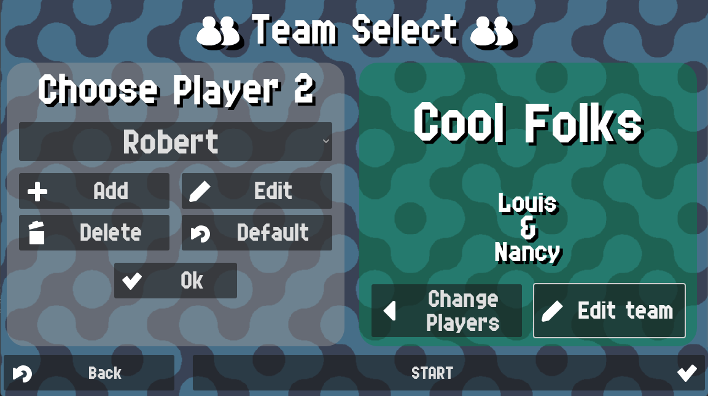

# Team Select

In this screen you can select the players that will play the match. After choosing the players, a team name
and a color for them will appear, and if you didn't choose any default players, they will be editable.

{: style="display:block;margin-left:auto;margin-right:auto;width:60%;padding-top:10px;padding-bottom:10px;"}

Team names will be used to be displayed alongside the score.

{: style="display:block;margin-left:auto;margin-right:auto;width:60%;padding-top:10px;padding-bottom:10px;"}

Player names will be used to display who serves on the current game.

{: style="display:block;margin-left:auto;margin-right:auto;width:60%;padding-top:10px;padding-bottom:10px;"}
