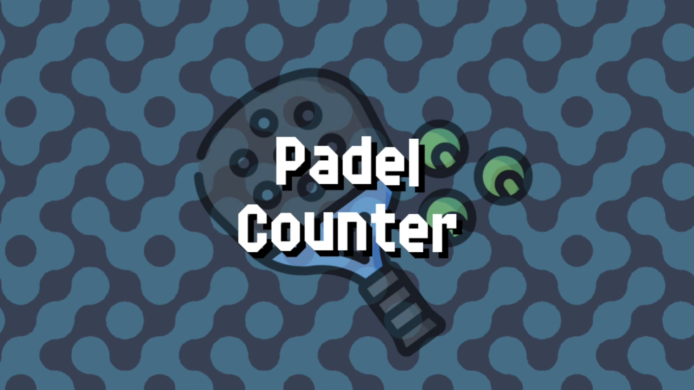

# Welcome to Padel Counter Documentation!

{: style="display:block;margin-left:auto;margin-right:auto;width:75%"}

This is the documentation for Padel Counter, the app I made to track score of padel matches!

Here you will find all the documentation related to the app.

You can find **other languages** at the language selector within **the top navigation bar**

Click one of the links below to start reading!

- [Recommended Setup](./setup.md)
- [Quick Start Guide](./quickstart.md)
- [Counter Configuration](./counter/counter.md)
- [Settings](./settings/index.md)
- [Help/Report an issue](./help.md)

## Support the project

Padel Counter is a free app, but if you want to support the project somehow, you can donate
any amount you like on my Ko-Fi profile.

[Click here to go to my Ko-Fi profile.](https://ko-fi.com/rabidrabid)

## Credits

- Icon ['Padel Racket'](https://www.flaticon.es/iconos-gratis/raqueta-de-padel) - by [Freepik](https://www.freepik.com/) for [Flaticon](https://www.flaticon.es/)
- Font ['Delta Block'](https://ggbot.itch.io/delta-block-font) - by [GGBotNet](https://www.ggbot.net/)
- Music ['Awake! (MegaWall-10)'](https://opengameart.org/content/awake-megawall-10) - by [cynicmusic](https://cynicmusic.com)
- Sound Effects from ['UI Audio'](https://kenney.nl/assets/ui-audio) pack - by [Kenney](https://kenney.nl/)
- Icons from ['Game Icons'](https://kenney.nl/assets/game-icons) - by [Kenney](https://kenney.nl/)
- Background patterns from ['Pattern Pack'](https://kenney.nl/assets/pattern-pack) - by [Kenney](https://kenney.nl/)
- Text To Speech by [BeepBooply](https://beepbooply.com/)
- [Animated background shader](https://www.youtube.com/watch?v=cObwzagwgmA) - by [Bacon and Games](https://www.youtube.com/@baconandgames)
- [Flame shader](https://www.youtube.com/watch?v=sCIr_58NN48) - by [Heartbeast](https://www.youtube.com/@uheartbeast)
- For the example custom sounds, the following sounds were used:
    - [Video Game Cheerful Ending](https://opengameart.org/content/video-game-cheerful-ending)
    - [Fireworks With Applause Happy People](https://opengameart.org/content/fireworks-with-applause-happy-people)
    - [Pure Aluminum Warfare Bunker Day 28](https://opengameart.org/content/pure-aluminum-warfare-bunker-day-28)
    - [Stick to it Day 17](https://opengameart.org/content/stick-to-it-day-17)
    - [Kenney Music Jingles](https://kenney.nl/assets/music-jingles)
- Special thanks to the [Godot Engine](https://godotengine.org) team and contributors by making the engine in which this app was made
