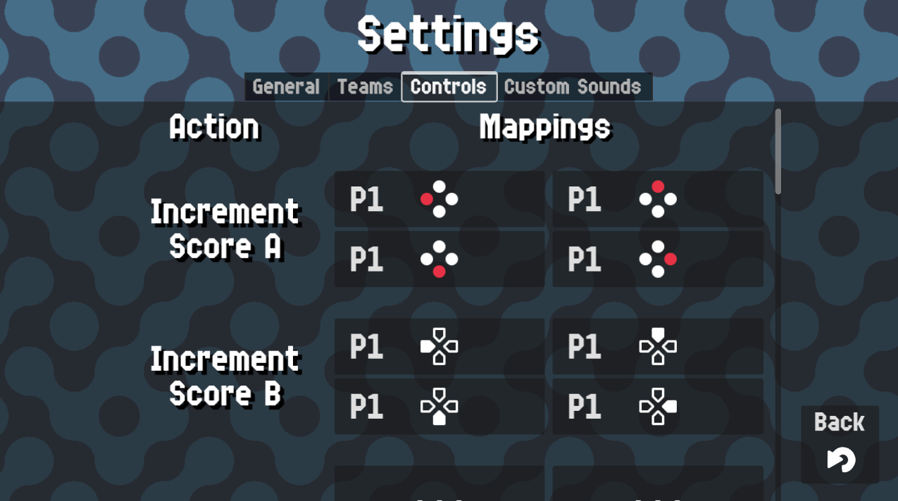

# Controls

{: style="display:block;margin-left:auto;margin-right:auto;width:60%;padding-top:10px;padding-bottom:10px;"}

In this screen you can remap actions to different input methods, for example a bluetooth gamepad/keyboard.

Each action has 4 remapping buttons. Pressing one of them will make a countdown appear so you will have to press the button you want to assign to that action. If you want to un-assign the button from an action, simply wait for the time to run out.

